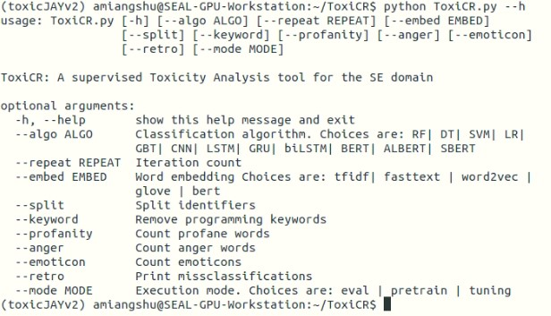

# ToxiCR
A supervised learning based tool to identify toxic code review comments

Read Our Papers <br />

#[TOSEM-23: "Automated Identification of Toxic Code Reviews Using ToxiCR",  https://dl.acm.org/doi/10.1145/3583562]

#[ASE 2022 (Short paper appeared in SRP): "‘Who built this crap?’ Developing a Software Engineering Domain Specific Toxicity Detector" https://dl.acm.org/doi/10.1145/3551349.3559508]

## Datasets

Our code review dataset is: /models/code-review-dataset-full.xlsx <br>

Our dataset contains total 19,671 labeled CR comments (initially, we had 19,571 CR labeled comments). 
Each comments is labeled as toxic (1) or non-toxic (0). Finally, the number of toxic comments is 3757 (~19% of the dataset). 


## Instructions to use the tool 
clone/download the project </br>
$git clone https://github.com/WSU-SEAL/ToxiCR.git

#install all the requirements: </br>
$ pip install -r "requirements.txt"


Now, you can view all the options for ToxiCR.py file using:</br>
$ python ToxiCR.py --h


<p align="center">
  
</p>

You can select any mode after:  $ python ToxiCR.py (put arguments)

<b> Retrain mode: </b>
to retrain the best performing BERT model (with keyword preprocessing): </br>
$ python ToxiCR.py --algo BERT --embed bert --keyword --mode pretrain

<b> Test Mode: </b>
$ python ToxiCRTest.py


## Copyright Information
 Copyright Software Engineering Analytics Lab (SEAL), Wayne State University, 2022
 Authors: Jaydeb Sarker <jaydebsarker@wayne.edu> and Amiangshu Bosu <abosu@wayne.edu>

This program is free software; you can redistribute it and/or
modify it under the terms of the GNU General Public License
version 3 as published by the Free Software Foundation.

This program is distributed in the hope that it will be useful,
but WITHOUT ANY WARRANTY; without even the implied warranty of
MERCHANTABILITY or FITNESS FOR A PARTICULAR PURPOSE. See the
GNU General Public License for more details.


## Citation for our papers
If you use our work, please cite our paper:

TOSEM-23: "Automated Identification of Toxic Code Reviews Using ToxiCR"
```
@article{10.1145/3583562,
author = {Sarker, Jaydeb and Turzo, Asif Kamal and Dong, Ming and Bosu, Amiangshu},
title = {Automated Identification of Toxic Code Reviews Using ToxiCR},
year = {2023},
publisher = {Association for Computing Machinery},
address = {New York, NY, USA},
issn = {1049-331X},
url = {https://doi.org/10.1145/3583562},
doi = {10.1145/3583562},
note = {Just Accepted},
journal = {ACM Trans. Softw. Eng. Methodol.},
month = {feb},
keywords = {natural language processing, tool development, toxicity, sentiment analysis, code review}
}
```

ASE 2022 (Short paper): "‘Who built this crap?’ Developing a Software Engineering Domain Specific Toxicity Detector" 

```
@inproceedings{10.1145/3551349.3559508,
author = {Sarker, Jaydeb},
title = {‘Who Built This Crap?’ Developing a Software Engineering Domain Specific Toxicity Detector},
year = {2023},
isbn = {9781450394758},
publisher = {Association for Computing Machinery},
address = {New York, NY, USA},
url = {https://doi.org/10.1145/3551349.3559508},
doi = {10.1145/3551349.3559508},
booktitle = {Proceedings of the 37th IEEE/ACM International Conference on Automated Software Engineering},
articleno = {200},
numpages = {3},
keywords = {toxicity, developers interaction, NLP, deep learning},
location = {Rochester, MI, USA},
series = {ASE '22}
}

```
